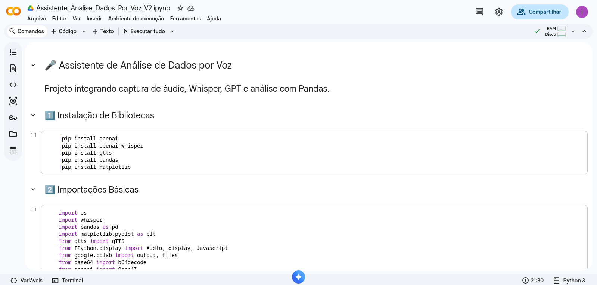

# 🎤 Assistente de Análise de Dados por Voz

Projeto acadêmico desenvolvido com fins **didáticos**, integrando
captura de áudio, reconhecimento de fala, geração automática de código
Python e análise de dados.

O sistema permite que o usuário faça perguntas por voz sobre um dataset
e receba como resposta:

-   📊 Análise estatística real
-   📈 Geração de gráficos (quando solicitado)
-   🔊 Resposta em áudio sintetizado

------------------------------------------------------------------------

## 📸 Demonstração

------------------------------------------------------------------------

## 🚀 Acesse no Google Colab

👉 Clique para abrir o notebook:

https://colab.research.google.com/drive/1hml3WABMZ9ko5colOZBnFPIffzyNVW-e?usp=sharing

------------------------------------------------------------------------

## 🎯 Objetivo do Projeto

Este projeto foi desenvolvido com **finalidade didática**, com o
objetivo de:

-   Demonstrar integração entre IA e análise de dados
-   Aplicar conceitos de processamento de linguagem natural
-   Explorar geração automática de código com modelos de linguagem
-   Criar uma experiência interativa baseada em voz

O foco principal é aprendizado e experimentação tecnológica.

------------------------------------------------------------------------

## 🧠 Arquitetura do Sistema

O pipeline funciona da seguinte forma:

1️⃣ Captura de áudio via navegador (MediaDevices API)\
2️⃣ Transcrição utilizando Whisper\
3️⃣ Interpretação da pergunta com modelo de linguagem (GPT)\
4️⃣ Geração automática de código Python (pandas / matplotlib)\
5️⃣ Execução da análise\
6️⃣ Conversão da resposta em áudio com gTTS

Fluxo simplificado:

Usuário (voz) ↓ Whisper (transcrição) ↓ Modelo de Linguagem
(interpretação) ↓ Geração de Código Python ↓ Execução com Pandas ↓
Resposta em Voz (gTTS)

------------------------------------------------------------------------

## 🛠 Tecnologias Utilizadas

-   Python\
-   Google Colab\
-   Whisper\
-   OpenAI API\
-   Pandas\
-   Matplotlib\
-   gTTS\
-   JavaScript (MediaRecorder API)

------------------------------------------------------------------------

## ⚙️ Como Executar

1.  Abra o notebook no Google Colab\
2.  Execute as células na ordem numerada\
3.  Insira sua API Key quando solicitado\
4.  Faça upload de um arquivo CSV\
5.  Grave sua pergunta por voz\
6.  Receba a análise e resposta falada

------------------------------------------------------------------------

## ⚠️ Observações

-   É necessário possuir uma API Key válida da OpenAI\
-   O projeto é voltado para fins educacionais\
-   A execução automática de código foi implementada para demonstração
    acadêmica
